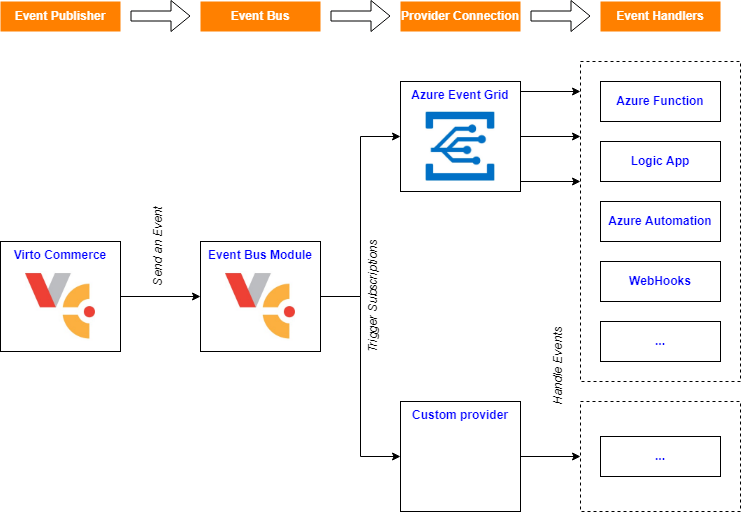

# Event Bus Module

## Overview

The Event Bus module enables event-driven integration between the Virto Commerce platform and external systems via message queues. It listens for domain events raised by any module, applies optional filtering and payload transformation, and forwards them to configured provider connections (e.g., Azure Event Grid). Subscriptions and connections can be managed through the REST API or declared in application configuration (`appsettings.json`).

## Key Features

* **Multi-provider architecture** — pluggable provider model allows registering custom event bus providers alongside the built-in Azure Event Grid provider
* **Automatic domain event discovery** — scans all loaded assemblies at startup and exposes every `IEvent` implementation as a subscribable event
* **Dual configuration sources** — subscriptions and connections can be defined in application settings or managed at runtime through the database via REST API
* **JsonPath event filtering** — each subscription supports a `JsonPath` expression to selectively forward only matching events
* **Liquid payload transformation** — Scriban/Liquid templates allow reshaping event payloads before delivery to the destination provider
* **CloudEvents data format** — the Azure Event Grid provider emits events using the [CloudEvents](https://cloudevents.io/) specification
* **Connection error logging** — failed event deliveries are persisted as provider connection logs with status, error message, and payload for diagnostics
* **Multi-database support** — supports SQL Server, MySQL, and PostgreSQL as persistence backends

## Configuration

### Application Settings

The module reads its configuration from the `EventBus` section in `appsettings.json`:

```json
{
  "EventBus": {
    "Connections": [
      {
        "Name": "myConnection",
        "ProviderName": "AzureEventGrid",
        "ConnectionOptionsSerialized": "{\"ConnectionString\":\"https://...\",\"AccessKey\":\"...\"}"
      }
    ],
    "Subscriptions": [
      {
        "Name": "mySubscription",
        "ConnectionName": "myConnection",
        "JsonPathFilter": "$",
        "PayloadTransformationTemplate": "",
        "Events": [
          { "EventId": "VirtoCommerce.Platform.Core.Events.DomainEvent" }
        ]
      }
    ]
  }
}
```

| Setting | Type | Default | Description |
|---------|------|---------|-------------|
| `EventBus:Connections` | `IList<ProviderConnection>` | `[]` | List of provider connections defined in configuration |
| `EventBus:Connections[].Name` | `string` | — | Unique name identifying the connection |
| `EventBus:Connections[].ProviderName` | `string` | — | Registered provider type name (e.g., `AzureEventGrid`) |
| `EventBus:Connections[].ConnectionOptionsSerialized` | `string` (JSON) | — | Provider-specific options as a serialized JSON object |
| `EventBus:Subscriptions` | `IList<Subscription>` | `[]` | List of event subscriptions defined in configuration |
| `EventBus:Subscriptions[].Name` | `string` | — | Unique name identifying the subscription |
| `EventBus:Subscriptions[].ConnectionName` | `string` | — | Name of the provider connection to route events to |
| `EventBus:Subscriptions[].JsonPathFilter` | `string` | `$` | JsonPath expression to filter events (default matches all) |
| `EventBus:Subscriptions[].PayloadTransformationTemplate` | `string` | `""` | Liquid template for transforming event payloads before sending |
| `EventBus:Subscriptions[].Events` | `ICollection<SubscriptionEvent>` | — | List of event IDs (fully qualified type names) to subscribe to |

#### Azure Event Grid Connection Options

| Setting | Type | Description |
|---------|------|-------------|
| `ConnectionString` | `string` | Azure Event Grid topic endpoint URL |
| `AccessKey` | `string` | Azure Event Grid access key |

### Permissions

| Permission | Description |
|------------|-------------|
| `eventbus:subscriptions:access` | Access to the Event Bus module |
| `eventbus:subscriptions:сreate` | Create new subscriptions and connections |
| `eventbus:subscriptions:read` | Read subscriptions, connections, and logs |
| `eventbus:events:read` | List available domain events |
| `eventbus:subscriptions:update` | Update existing subscriptions and connections |
| `eventbus:subscriptions:delete` | Delete subscriptions and connections |

## Architecture



### Key Flow

1. **Event discovery** — On startup, `RegisteredEventService` scans all loaded assemblies to find every class implementing `IEvent` and caches the list.
2. **Handler registration** — `DefaultEventBusSubscriptionsManager.RegisterEvents()` registers itself as a global `ICancellableEventHandler<DomainEvent>` via the platform's `IEventHandlerRegistrar`.
3. **Event raised** — When any platform domain event fires, the handler receives it and resolves its fully qualified type name as the event ID.
4. **Subscription lookup** — The manager queries both application settings and the database for subscriptions matching the event ID.
5. **JsonPath filtering** — For each matching subscription, the event payload is evaluated against the subscription's `JsonPathFilter`. If no tokens match, the event is skipped.
6. **Payload transformation** — If a `PayloadTransformationTemplate` is defined, the event payload is rendered through a Scriban/Liquid template; otherwise, the raw domain event is used.
7. **Provider dispatch** — The transformed payload is wrapped in an `Event` object and sent to the configured provider via `EventBusProvider.SendEventsAsync()`.
8. **Azure Event Grid delivery** — The `AzureEventBusProvider` converts events to `CloudEvent` objects and publishes them to the configured Event Grid topic endpoint.
9. **Error logging** — If delivery fails, a `ProviderConnectionLog` entry is created with status code, error message, and serialized payload, then persisted to the database.

## Components

### Projects

| Project | Layer | Purpose |
|---------|-------|---------|
| VirtoCommerce.EventBusModule.Core | Core | Domain models, service interfaces, options, permissions, and extensions |
| VirtoCommerce.EventBusModule.Data | Data | Service implementations, EF Core repository, DbContext, caching, and Azure provider |
| VirtoCommerce.EventBusModule.Data.SqlServer | DB Provider | SQL Server EF Core configuration and migrations |
| VirtoCommerce.EventBusModule.Data.MySql | DB Provider | MySQL (Pomelo) EF Core configuration and migrations |
| VirtoCommerce.EventBusModule.Data.PostgreSql | DB Provider | PostgreSQL (Npgsql) EF Core configuration and migrations |
| VirtoCommerce.EventBusModule.Web | Web | ASP.NET Core module entry point, API controllers, and DI registration |
| VirtoCommerce.EventBusModule.Tests | Tests | Unit tests (xUnit + Moq) |

### Key Services

| Service | Interface | Responsibility |
|---------|-----------|----------------|
| `DefaultEventBusSubscriptionsManager` | `IEventBusSubscriptionsManager` | Global domain event handler; resolves subscriptions, filters, transforms, and dispatches events to providers |
| `AzureEventBusProvider` | `EventBusProvider` (abstract) | Sends events to Azure Event Grid as CloudEvents using `EventGridPublisherClient` |
| `EventBusProviderService` | `IEventBusProviderService` | Registry for event bus provider types; creates provider instances by name |
| `EventBusProviderConnectionsService` | `IEventBusProviderConnectionsService` | Resolves and caches connected provider instances from configuration or database |
| `EventBusSubscriptionsService` | `IEventBusSubscriptionsService` | Unified subscription lookup merging configuration and database sources |
| `EventBusReadConfigurationService` | `IEventBusReadConfigurationService` | Reads subscriptions and connections from `EventBusOptions` (appsettings) |
| `RegisteredEventService` | *(concrete)* | Discovers and caches all `IEvent` implementations from loaded assemblies |
| `SubscriptionService` | `ISubscriptionService` | CRUD operations for subscriptions (database) |
| `SubscriptionSearchService` | `ISubscriptionSearchService` | Search for subscriptions with filtering criteria |
| `ProviderConnectionService` | `IProviderConnectionService` | CRUD operations for provider connections (database) |
| `ProviderConnectionSearchService` | `IProviderConnectionSearchService` | Search for provider connections with filtering criteria |
| `ProviderConnectionLogService` | `IProviderConnectionLogService` | CRUD operations for provider connection error logs |
| `ProviderConnectionLogSearchService` | `IProviderConnectionLogSearchService` | Search for provider connection logs with date range filtering |

### REST API

Base route: `api/eventbus`

| Method | Endpoint | Description |
|--------|----------|-------------|
| GET | `/events?skip={skip}&take={take}` | List all discovered domain events (paginated) |
| POST | `/subscriptions/search` | Search subscriptions (DB + configuration) by name, connection, or event IDs |
| GET | `/subscriptions/{name}` | Get a specific subscription by name |
| POST | `/subscriptions` | Create a new subscription in the database |
| PUT | `/subscriptions` | Update an existing database subscription |
| DELETE | `/subscriptions/{name}` | Delete a database subscription by name |
| POST | `/connections/search` | Search provider connections (DB + configuration) by name or provider |
| GET | `/connections/{name}` | Get a specific provider connection by name |
| POST | `/connections` | Create a new provider connection in the database |
| PUT | `/connections` | Update an existing database provider connection |
| DELETE | `/connections/{name}` | Delete a database provider connection by name (fails if subscriptions exist) |
| POST | `/logs/search` | Search provider connection error logs by name and date range |

### Configuring Provider Connections
Each provider connection definition is a link between provider type and connection options. You can have multiple connections to various destinations through a single provider.

#### Provider Connection Options Data Structure

Example:
```json
{
    "Name": "AzureEventGrid cloud",
    "ProviderName": "AzureEventGrid",
    "ConnectionOptionsSerialized": "{\"ConnectionString\": \"https://*.*.eventgrid.azure.net/api/events\", \"AccessKey\": \"kvpXffggvvMiNjBeBKdroX1r45UvZloXMwlM7i1TyqoiI=\"}"
}
```
#### Description:
|Name|Description|
|-|-|
|Name|Human-readable connection name to distinguish the connection. Should be unique in the configuration|
|ProviderName|Predefined destination provider name. Unique for each type of providers. Refers to the name of desired provider|
|ConnectionOptionsSerialized|Provider-specific connection options|

### Managing Provider Connections through Configuration
Add connections array under the `EventBus:Connections` key. Connections configured in such a manner cannot be removed or updated through REST API.

If you have connections with the same name in the DB and configuration options, the one specified in the configuration options will be preferred.

### Managing Provider Connections through REST API

#### Adding New Connection
Endpoint: `/api/eventbus/connections`

Method: `POST`

Request: 
```json
{
  "name": "string",
  "providerName": "string",
  "connectionOptionsSerialized": "string"
}
```
The request body is the same as in the connection option description above.

#### Removing Connection by Name
Endpoint: `/api/eventbus/connections/{name}`

Method: `DELETE`

Request parameter: Provider connection name

#### Updating connection
Endpoint: `/api/eventbus/connections`

Method: `PUT`

Request: 
```json
{
  "name": "string",
  "providerName": "string",
  "connectionOptionsSerialized": "string"
}
```
The request body is the same as in the connection option description above.

#### **Getting Connection by Name**
Endpoint: `/api/eventbus/connections/{name}`

Method: `GET`

Request parameter: Provider connection name

Response:
```json
{
  "name": "string", // Connection name
  "providerName": "string", // Provider name
  "connectionOptionsSerialized": "string", // Provider-specific connection options
  "createdDate": "2022-08-26T13:52:55.932Z",
  "modifiedDate": "2022-08-26T13:52:55.932Z",
  "createdBy": "string", // If null, the connection specified in the configuration
  "modifiedBy": "string", // If null, the connection specified in the configuration
  "id": "string" // If null, the connection specified in the configuration
}
```

#### Searching for Connections

Endpoint: `/api/eventbus/connections/{name}`

Method: `GET`

Request:
```json
{
  "name": "string", // Connection name (optional, pass to search by name)
  "providerName": "string", // Provider name (optional, pass to search by provider name)
  "skip": 0, // providers to skip in paged loading
  "take": 0  // providers to take in paged loading
}
```

Response:
```json
{
  "totalCount": 0, 
  "results": [
    {
      "name": "string", // Connection name
      "providerName": "string", // Provider name
      "connectionOptionsSerialized": "string", // Provider-specific connection options
      "createdDate": "2022-08-26T13:52:55.932Z",
      "modifiedDate": "2022-08-26T13:52:55.932Z",
      "createdBy": "string", // If null, the connection specified in the configuration
      "modifiedBy": "string", // If null, the connection specified in the configuration
      "id": "string" // If null, the connection specified in the configuration
    }
  ]
}
```

### Configuring Subscriptions

Subscription is a rule that specifies which events should be caught and forwarded to a selected provider connection. You can also translate the event body to fit the payload needs of a provider.

#### Subscription Options Data Structure

Example:
```json
{
  "ConnectionName": "AzureEventGrid",
  "Name": "Eventgrid forwarder",
  "JsonPathFilter": "$",
  "PayloadTransformationTemplate": "",
  "EventSettingsSerialized": null,
  "Events": [
      {
          "EventId": "VirtoCommerce.YourModule.Web.Events.NewCompanyRegistrationRequestEvent"
      }
  ]
}
```
#### Description:
|Name|Description|
|-|-|
|ConnectionName|Name of the connection the event data should be forwarded to.|
|Name|Human-readable name to distinguish subscriptions. Should be unique in configuration|
|JsonPathFilter|`JsonPath` filter expression that allows you to additionally filter events that have specific value in the body. If the body with applied `JsonPath` filter does not yield any value, the module will not call the provider. The default value is `$`, which means any event body is OK and may be transferred to the provider. We use Newtonsoft.Json to [query Jsons](https://www.newtonsoft.com/json/help/html/SelectToken.htm#SelectTokenJSONPath).  Find out more about JsonPath [here](http://goessner.net/articles/JsonPath/). Also [there](https://jsonpath.com) is an useful tool to test your jsons and queries.|
|PayloadTransformationTemplate|An optional setting where you can specify a Scriban-template to transform event data to a different form. If omitted, null, or an empty string, the event data will be transferred unchanged to the provider (full body).|
|EventSettingsSerialized|An optional setting where you can set subscription-specific metadata for the provider as details of the event interpretation. This may include some rules, instructions for the provider, etc. For example, if you hypothetically have a workflow provider, you can set what such provider needs to do as a reaction for the event catch: start a new workflow chain or signal an existing workflow instance. The value varies from provider to provider. Please read the provider instruction.|
|Events|Array of the event full names the subscription in question should catch.|

### Managing Subscriptions through Configuration
Add the subscription array under the key "EventBus:Subscriptions". Subscriptions configured in such a manner cannot be removed or updated through REST API.

If you have subscriptions with the same name in the DB and configuration options, the one specified in the configuration options will be preferred.

### Managing Subscriptions through REST API

#### **Get specific subscription by name**
Endpoint: `/api/eventbus/subscriptions/{name}`

Method: `GET`

Request parameter: Subscription name

Response:
```json
{
  "name": "string",
  "connectionName": "string",
  "jsonPathFilter": "string",
  "payloadTransformationTemplate": "string",
  "eventSettingsSerialized": "string",
  "events": [
    {
      "eventId": "string"
    }
  ],
  "createdDate": "2022-08-29T11:30:09.038Z",
  "modifiedDate": "2022-08-29T11:30:09.038Z",
  "createdBy": "string", // If null, the subscription specified in the configuration
  "modifiedBy": "string", // If null, the subscription specified in the configuration
  "id": "string" // If null, the subscription specified in the configuration
}
```
#### **Registering New Subscription in Database**

Endpoint: `/api/eventbus/subscriptions`

Method: `POST`

Request body (also check the subscription option description above):

```json
{
  "name": "string",
  "connectionName": "string",
  "jsonPathFilter": "string",
  "payloadTransformationTemplate": "string",
  "eventSettingsSerialized": "string",
  "events": [
    {
      "eventId": "string"
    }
  ]
}
```

#### Updating Existing Subscription (DB Registered Only)
You may want to update the event subscription, so that you could update a set of events.

Endpoint: `/api/eventbus/subscriptions`

Method: `PUT`

Request body (also check the subscription option description above):

```json
{
  "name": "string",
  "connectionName": "string",
  "jsonPathFilter": "string",
  "payloadTransformationTemplate": "string",
  "eventSettingsSerialized": "string",
  "events": [
    {
      "eventId": "string"
    }
  ]
}
```

#### Deleting Existing Subscription by Name (DB Registered Only)
You may want to remove the event subscription, so that you could stop receiving event notifications.

Endpoint: `/api/eventbus/subscriptions/{name}`

Method: `DELETE`


#### Viewing List of Subscriptions or Searching for Existing Subscriptions (DB Registered and Configuration Registered)
You may want to see the event subscriptions, so that you know which subscriptions exist.

Endpoint: `/api/eventbus/subscriptions/search`

Method: `POST`

Request body:

```json
{
  "name": "string", // Subscription name (optional, pass to search by name)
  "connectionName": "string", // Provider connection name (optional, pass to search by it)
  "eventIds": [ // Optional. Pass to search subscriptions by event ids
    "string"
  ],
  "skip": 0, // subscriptions to skip in paged loading
  "take": 0 // subscriptions to take in paged loading
}
```

Response:

```json
{
  "totalCount": 0,
  "results": [
    {
      "name": "string",
      "connectionName": "string",
      "jsonPathFilter": "string",
      "payloadTransformationTemplate": "string",
      "eventSettingsSerialized": "string",
      "events": [
        {
          "eventId": "string",
        }
      ],
      "createdDate": "2022-08-29T11:53:53.653Z",
      "modifiedDate": "2022-08-29T11:53:53.653Z",
      "createdBy": "string", // If null, the subscription specified in the configuration
      "modifiedBy": "string", // If null, the subscription specified in the configuration
      "id": "string" // If null, the subscription specified in the configuration
    }
  ]
}

```
### Discovering Current List of Events or Resources
If you want to see the full list of the existing events to properly create a subscription, here is how:

Endpoint: `/api/eventbus/events`

Method: `GET`

Request: `/api/eventbus/events?skip=0&take=20`

Response:

```json
[
  {
    "id": "VirtoCommerce.CatalogModule.Core.Events.ProductChangedEvent"
  },
  ...
]
```

## Destination Providers

### Azure Event Grid Provider

#### Overview

[Azure Event Grid](https://azure.microsoft.com/en-us/services/event-grid/) can be used to push messages to Azure Functions, HTTP endpoints (webhooks), and some other Azure tools.

Azure Event Grid supports CloudEvents 1.0, while the Azure Event Grid client library also supports sending and receiving events in the form of CloudEvents.

The Event Bus module contains Azure Event Grid provider, which is ready to use. To connect to it, you need to define the provider connection with the `AzureEventGrid` provider name, and fill connection option data structure (the `ConnectionOptionsSerialized` field) with the following value:

```json
{
  "ConnectionString": "https://*.*.eventgrid.azure.net/api/events", 
  "AccessKey": "kvpXffggvvMiNjBeBKdroX1r45UvZloXMwlM7i1TyqoiI="
}
```

* `connectionString`: String that defines the URI of the topic
* `accessKey`: String that is partially hidden on retrieval

To set up a subscription with Azure Event Grid, you need first to create a topic in the [Azure Portal](https://azure.microsoft.com/en-us/services/event-grid/). When creating your Event Grid topic, you need to set the input schema to `CloudEvents v1.0` in the *Advanced* tab. To allow Virto Commerce Platform to push messages to your topic, you need to provide an access key. These can also be found in the Azure Portal after creating the topic in the *Access Keys* section.

The `EventSettingsSerialized` option of the subscription is not used by this provider and should be skipped.

#### Error Handling
Event Grid provides durable delivery. It delivers each message at least once for each subscription. Events are sent to the registered endpoint of each subscription immediately. If an endpoint does not acknowledge the receipt of an event, Event Grid retries delivery of the event.

You can find more details about this in [Azure Portal](https://docs.microsoft.com/en-us/azure/event-grid/delivery-and-retry).


#### Default Event Data Model for Azure Event Grid
As mentioned above, you can specify the payload transformation through the Scriban-template with the `payloadTransformationTemplate` option.

If you skip this option, the Event Grid provider will apply the following structure as a payload in the `CloudEvents` format, as here:

```json
{​​​​​
    "ObjectId": "4038511b-604a-4031-9aba-775bbac43a39",
    "ObjectType": "VirtoCommerce.OrdersModule.Core.Model.CustomerOrder",
    "EventId": "VirtoCommerce.OrdersModule.Core.Events.OrderChangedEvent"
}
```

* `ObjectId` (string type): Object unique identifier
* `ObjectType` (string type): Full name of related object type
* `EventId` (string type): Full name of the Event ID; required

The Event Grid provider discovers all objects related to the event being transferred and generates payloads for each of them.

#### Sample Event in `CloudEvents` 1.0 JSON Format

```json
{​​​​​
  "id": "9ec0a767-5789-4149-83ea-bd227570e54a",
  "source": "399c9dda-aff9-4bd9-87b4-326dbe2815a9",
  "data": {​​​​​
    "ObjectId": "4038511b-604a-4031-9aba-775bbac43a39",
    "ObjectType": "VirtoCommerce.OrdersModule.Core.Model.CustomerOrder",
    "EventId": "VirtoCommerce.OrdersModule.Core.Events.OrderChangedEvent"
  }​​​​​,
  "type": "VirtoCommerce.OrdersModule.Core.Events.OrderChangedEvent",
  "time": "2021-02-26T08:45:57.3896153Z",
  "specversion": "1.0",
  "traceparent": "00-22fb7c5208a34c41811cca2715e8d71e-d856ef9e25234f41-00"
}​​​​​
```


## Health Status and Searching for Fail Log
There is API endpoint that allows you to view the fail log.

Endpoint: `/api/eventbus/logs/search`

Method: `POST`

Request:

```json
{
  "providerConnectionName": "string", // Optional. Pass to filter the log by provider connection
  "startCreatedDate": "2022-08-29T12:42:07.944Z", // Start date of event occurrence
  "endCreatedDate": "2022-08-29T12:42:07.944Z", // Start date of event occurrence
  "skip": 0, // errors to skip in paged loading
  "take": 0 // errors to take in paged loading
}
```

Response:

```json
{
  "totalCount": 0,
  "results": [
    {
      "providerName": "string", // Provider connection name
      "status": 0, // Error status
      "errorMessage": "string", // Error message
      "createdDate": "2022-08-29T12:47:07.793Z", // Date of occurrence
    }
  ]
}
```

Records in response are always ordered by the date of occurrence, descending.

## How to Send Custom Event from Virto Commerce
The module reads the list of the events from installed modules.

If you want to send a new event, you need to create a new module and [raise a Virto Commerce event](https://virtocommerce.com/docs/latest/fundamentals/extensibility/extending-using-events/). After this, the event will be accessible via API, and you will be able to create a subscription.  

## Support for Custom Destination Providers 
Feel free to contact us if you need a new destination.

# More examples (close to real cases)
## Additional event filtering example
Look at the subscription example forwarding order changed event if the state changed to specified only:

``` json
"Subscriptions": [
    {
        "ConnectionName": "AzureEventGrid",
        "Name": "Eventgrid forwarder",
        "JsonPathFilter": "$.ChangedEntries[?(@.NewEntry.Status == 'Processing' && @.OldEntry.Status != 'Processing')]",
        "Events": [
            {
                "EventId": "VirtoCommerce.OrdersModule.Core.Events.OrderChangedEvent"
            }
        ]
    }
]
```
Please read carefully `JsonPathFilter` expression above. The event data will be forwarded to the connection if the selection with specified `JsonPathFilter` results any value.

In example: any order comes in status `Processing` from any other non-processing state. Another words: we check that new status in the event body is `Processing` and old status value is something different.

You can construct more sophisticated expressions for events filtering. 

As we use Newtonsoft JsonNet library to select tokens in the json-documents, there are good place to learn JsonPath: [Newtonsoft JsonNet documentation: Querying JSON with JSON Path](https://www.newtonsoft.com/json/help/html/QueryJsonSelectToken.htm).

## Payload transformation template example
The transformation template allows you to transform the event data to a custom payload for your specific case. Also, it is useful to shrink an amount of transferred data.
Look at the subscription example:
``` json
"Subscriptions": [
    {
        "ConnectionName": "AzureEventGrid",
        "Name": "Eventgrid forwarder",
        "JsonPathFilter": "$.ChangedEntries[?(@.NewEntry.Status == 'Processing' && @.OldEntry.Status != 'Processing')]",
        "PayloadTransformationTemplate": "{ \"EventId\": \"{{ id }}\", \"OrderInfo\": [ {{for entry in changed_entries}} { \"NewStatus\": \"{{ entry.new_entry.status }}\", \"OldStatus\": \"{{ entry.old_entry.status }}\", \"Items\":[ {{for item in entry.new_entry.items}} { \"Name\": \"{{item.name}}\", \"Sku\": \"{{item.sku}}\" }, {{end}} ] }, {{end}} ] }",
        "Events": [
            {
                "EventId": "VirtoCommerce.OrdersModule.Core.Events.OrderChangedEvent"
            }
        ]
    }
]
```
As you can see, `PayloadTransformationTemplate` value set to some value. It's a one-line, double-comma escaped value of a following Scriban-template:
``` scriban
{
  "EventId": "{{ id }}",
  "OrderInfo": [
    {{for entry in changed_entries}}
      {
        "NewStatus": "{{ entry.new_entry.status }}",
        "OldStatus": "{{ entry.old_entry.status }}",
        "Items":[
          {{for item in entry.new_entry.items}}
            {
              "Name": "{{item.name}}",
              "Sku": "{{item.sku}}"
            },
          {{end}}
        ]
      },
    {{end}}
  ]
}
```
The template just get old and new statuses of the changed order, then enlists items names and SKUs.
Look at the result of applying the template to the data in `OrderChangedEvent` for some order with 2 items:
``` json
{
  "EventId": "f90bcd6b-e32b-4d53-9e32-69b9b7fef584",
  "OrderInfo": [
    {
      "NewStatus": "Processing",
      "OldStatus": "New",
      "Items": [
        {
          "Name": "Samsung Galaxy S6 SM-G920F 32GB, White Pearl, 1.5 GHz ARM Cortex A53 Quad-Core, 3, 32",
          "Sku": "IZZ-25623049"
        },
        {
          "Name": "Microsoft Lumia 640 XL RM-1065 8GB Dual SIM, Black, true, true, 1.2 GHz ARM Cortex A7 Quad-Core, 1, 8",
          "Sku": "UWT-27354339"
        }
      ]
    }
  ]
}
```

This selected payload only would be send to the provider.

## Documentation

* [Scriban syntax](https://github.com/scriban/scriban/tree/master/doc)
* [Test your Scriban-template](https://scribanonline.azurewebsites.net)
* [Event Bus module user documentation](https://docs.virtocommerce.org/platform/user-guide/event-bus/overview/)
* [REST API reference](https://virtostart-demo-admin.govirto.com/docs/index.html?urls.primaryName=VirtoCommerce.EventBus)
* [View on GitHub](https://github.com/VirtoCommerce/vc-module-event-bus/)

## References

* [Deployment](https://docs.virtocommerce.org/platform/developer-guide/Tutorials-and-How-tos/Tutorials/deploy-module-from-source-code/)
* [Installation](https://docs.virtocommerce.org/platform/user-guide/modules-installation/)
* [Home](https://virtocommerce.com)
* [Community](https://www.virtocommerce.org)
* [Download latest release](https://github.com/VirtoCommerce/vc-module-event-bus/releases/latest)

## License

Copyright (c) Virto Solutions LTD. All rights reserved.

This software is licensed under the Virto Commerce Open Software License (the "License"); you
may not use this file except in compliance with the License. You may
obtain a copy of the License at http://virtocommerce.com/opensourcelicense.

Unless required by the applicable law or agreed to in written form, the software
distributed under the License is provided on an "AS IS" BASIS,
WITHOUT WARRANTIES OR CONDITIONS OF ANY KIND, either express or
implied.
