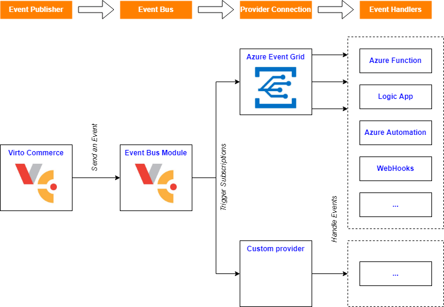

# Virto Commerce Event Bus Module

    

The module enables you to be notified of new Virto Commerce events or changes via a Message Queue of your choice.

The module is used to trigger an asynchronous background process in response to an event on the Virto Commerce platform.

As a payload, a Virto Commerce Event delivers one of the predefined Messages or any Change to a resource.

That enables event-driven, reactive programming. It uses a publish-subscribe model. Publishers emit events but have no expectation about which events are handled. Subscribers decide which events they want to handle.

The event description is based on CloudEvents: "specification for describing event data in a common way".

## Key features
* Notify of new messages or changes from any module
* Destination to
  * [Azure Event Grid](https://azure.microsoft.com/en-us/services/event-grid)
  * !!! Coming Soon !!! - AWS SQS, AWS SNS, Azure Service Bus, Google Cloud Pub/Sub
* [CloudEvents](https://cloudevents.io/) format
* Support multiple destination providers
* Configurable via API
* High Performance

## Documentation
* [Module Documentation](https://virtocommerce.com/docs/latest/modules/event-bus/)
* [View on GitHub](docs/index.md)

## References
* Deploy: https://virtocommerce.com/docs/latest/developer-guide/deploy-module-from-source-code/
* Installation: https://www.virtocommerce.com/docs/latest/user-guide/modules/
* Home: https://virtocommerce.com
* Community: https://www.virtocommerce.org
* [Download Latest Release](https://github.com/VirtoCommerce/vc-module-event-bus/releases/latest)

## License

Copyright (c) Virto Solutions LTD.  All rights reserved.

Licensed under the Virto Commerce Open Software License (the "License"); you
may not use this file except in compliance with the License. You may
obtain a copy of the License at

http://virtocommerce.com/opensourcelicense

Unless required by applicable law or agreed to in writing, software
distributed under the License is distributed on an "AS IS" BASIS,
WITHOUT WARRANTIES OR CONDITIONS OF ANY KIND, either express or
implied.
